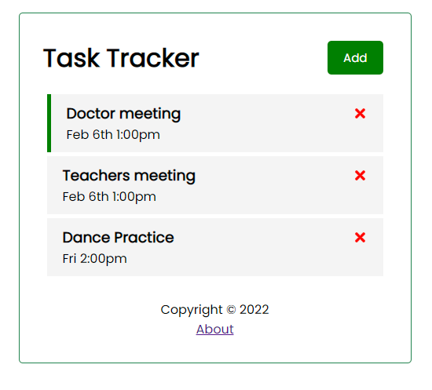

# React Task Tracker

This is a personal project in my quest to master REACT, and collect all the infinity stones (MERN). 



## About

This is a simple task tracker that allows users to :
* ```Add ```new tasks that they wish to keep track of
* ```delete``` any old or completed tasks
* Set a ```Reminder```for any existing tasks

## Technologies
Project is created with:
* React.js

## Launch
Follow the steps below to launch the Task Tracker on a local json server:
1. ```$ npm i json-server```
2. Create a ```server``` script in package.json

   ```javascript
   "server": "json-server --watch db.json --port 5000"
   ```
3. ```$ npm run server```
4. New Terminal Tab to run dev server:

   ```npm start```
5. Paste whatever initial tasks into the db.json created

## Contributing
Pull requests are welcome. For major changes, please open an issue first to discuss what you would like to change.

Please make sure to update tests as appropriate.

## License
[MIT](https://choosealicense.com/licenses/mit/)
